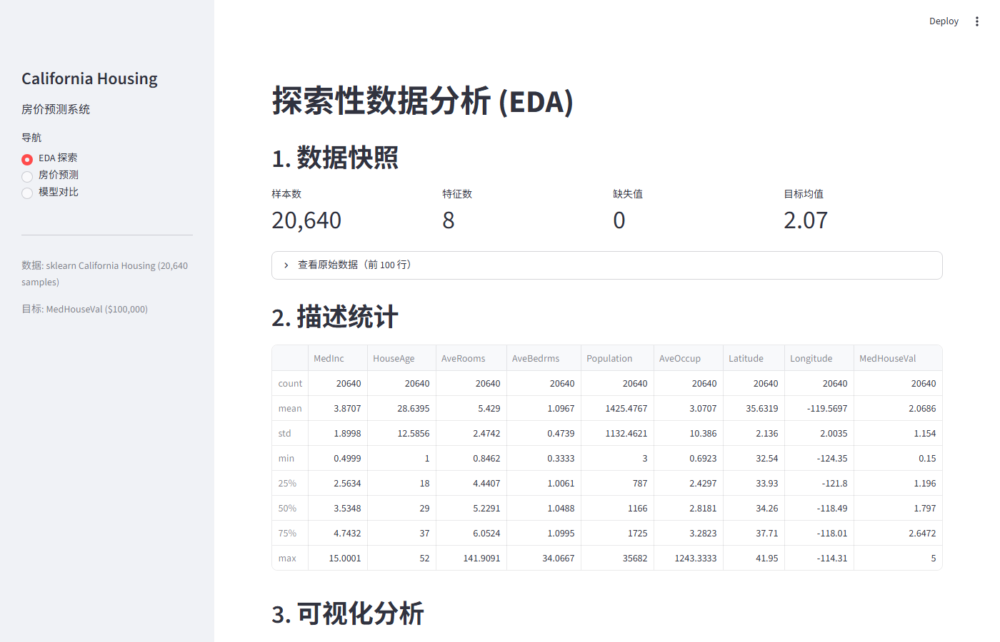

# Smart House Price Prediction

基于 California Housing 数据集的房价预测系统，包含完整的 ML 流水线：EDA → 预处理 → 多模型训练 → 交互式 Web 应用。

## Live Demo

:point_right: **[在线体验 →](https://sjy-jshuaian-smart-house-price-predicti-appstreamlit-app-qsxhor.streamlit.app/)**

> 部署于 [Streamlit Community Cloud](https://streamlit.io/cloud)，无需安装即可试用。



## Quick Start

```bash
# 1. 安装依赖
pip install -r requirements.txt

# 2. 生成数据拆分 + 标准化
python src/features/split_features_target.py
python src/data/preprocess.py

# 3. 训练模型（三选一或全跑）
python src/models/train_linear_regression.py
python src/models/decision_tree_demo.py
python src/models/random_tree_demo.py

# 4. 启动 Web 应用
streamlit run app/streamlit_app.py
```

## Project Structure

```
├── app/streamlit_app.py              # Streamlit Web 应用
├── src/
│   ├── data/
│   │   ├── loader.py                 # 数据加载（sklearn + CSV）
│   │   └── preprocess.py             # 标准化流水线（Standard + Robust）
│   ├── features/
│   │   └── split_features_target.py  # 特征/标签拆分 + train/val/test
│   ├── visualization/                # EDA 可视化脚本（7 个）
│   └── models/                       # 模型训练脚本（3 个）
├── models/                           # 训练好的模型（.pkl）
├── data/
│   ├── raw/                          # 原始数据
│   └── processed/                    # 拆分 + 标准化后的数据
├── reports/
│   ├── final_report.md               # EDA 分析报告
│   ├── System_Test_Report.md         # 系统测试报告
│   └── figures/                      # 所有图表
└── tests/                            # 单元测试
```

## Model Performance

| Model | Test R^2 | Test RMSE |
|-------|----------|-----------|
| Linear Regression | 0.5758 | $74,561 |
| Decision Tree | 0.6849 | $64,260 |
| **Random Forest** | **0.8013** | **$51,021** |

## Dataset

[California Housing](https://scikit-learn.org/stable/datasets/real_world.html#california-housing-dataset) — 20,640 个街区组样本，8 个特征，目标为中位房价（$100,000 单位）。

## Key Findings (EDA)

- **最强预测因子**: `MedInc`（中位收入），皮尔逊 r = +0.688
- **天花板效应**: 目标变量在 $500K 截断，影响约 4.8% 样本
- **多重共线性**: Latitude <-> Longitude (r=-0.92)、AveRooms <-> AveBedrms (r=+0.85)
- **异常值**: AveBedrms (6.9%)、Population (5.8%) 需 RobustScaler 处理
