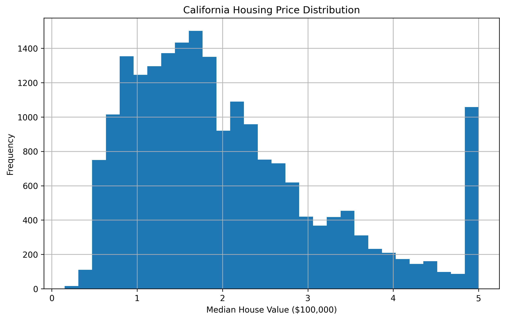
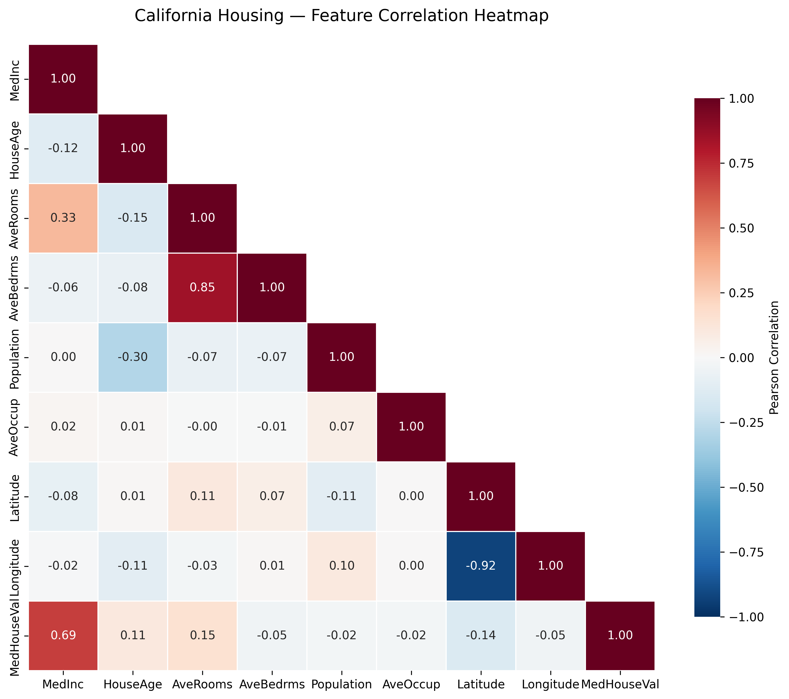
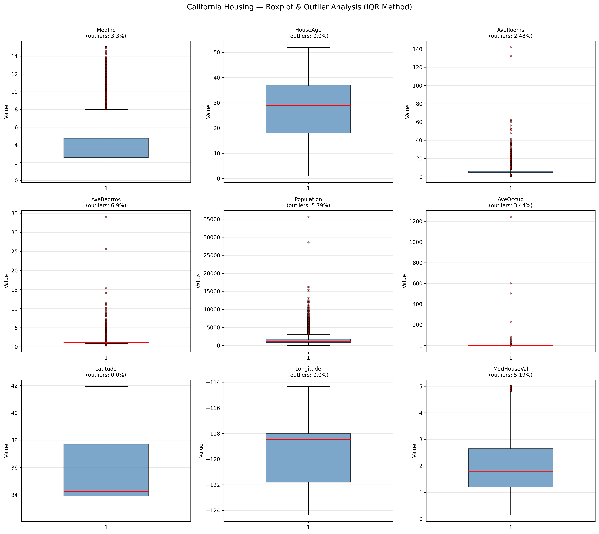
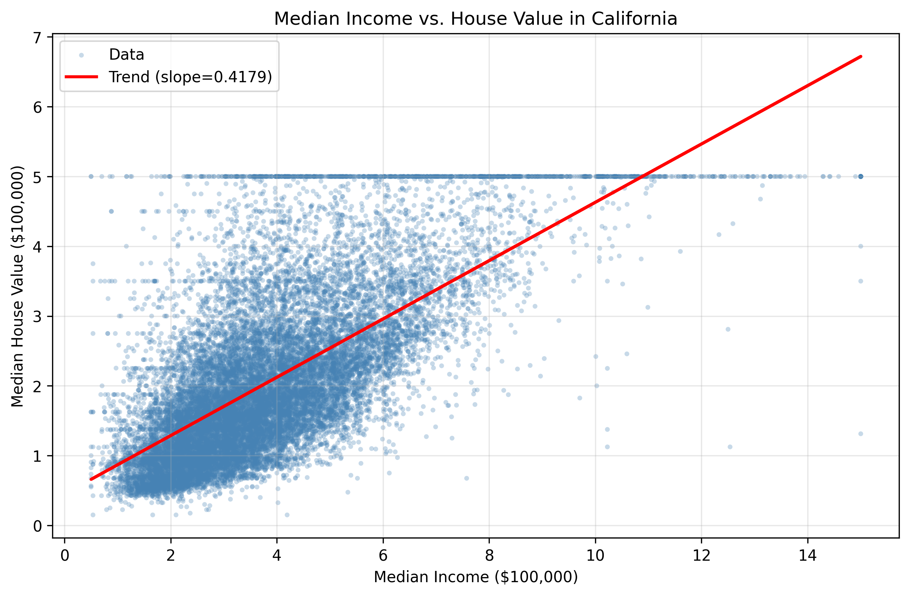
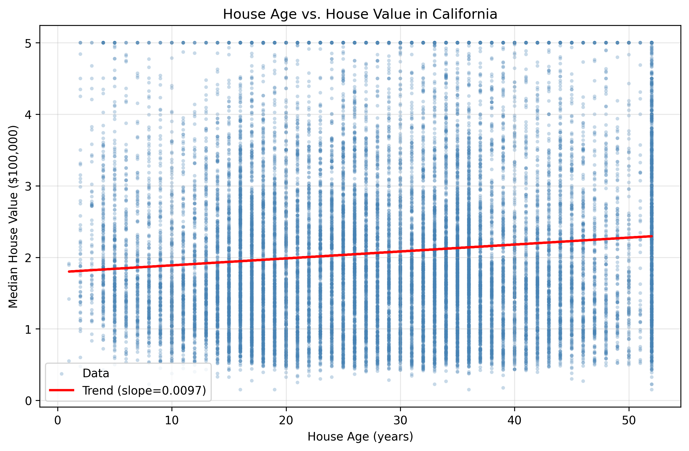
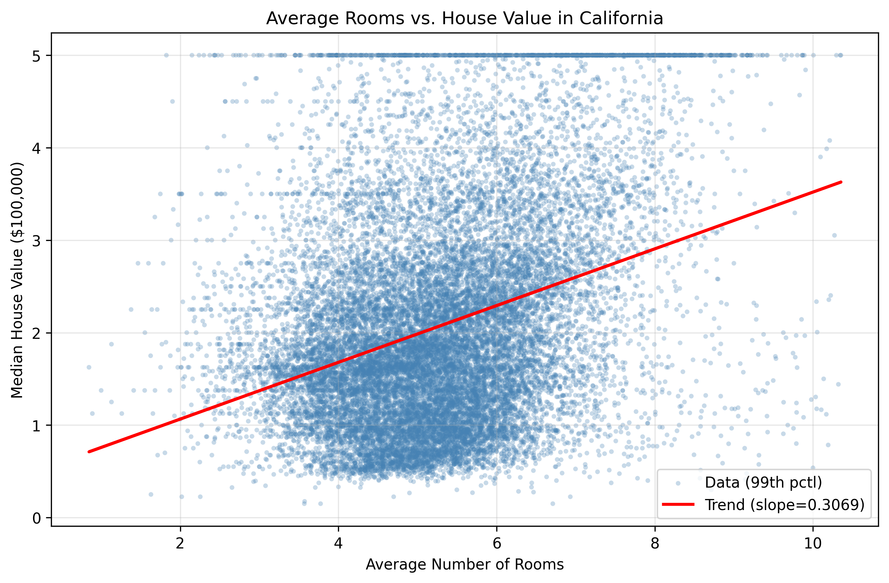

# California Housing — EDA 分析报告

**生成时间**: 2026-06-11 23:07:15
**数据来源**: `sklearn.datasets.fetch_california_housing`

---

## 1. 数据集概览

| 指标 | 值 |
|------|----|
| 样本数 | 20,640 |
| 特征数 | 9 |
| 缺失值 | 0（所有列完整） |
| 目标变量 | `MedHouseVal`（中位房价，单位 $100,000） |
| 数值特征 | 8 个（均为 `float64`） |

**列名与类型**:

-     `MedInc` — `float64`
-     `HouseAge` — `float64`
-     `AveRooms` — `float64`
-     `AveBedrms` — `float64`
-     `Population` — `float64`
-     `AveOccup` — `float64`
-     `Latitude` — `float64`
-     `Longitude` — `float64`
- >> Target `MedHouseVal` — `float64`

---

## 2. 描述性统计

### 2.1 核心统计量

| Feature | count | mean | std | min | 25% | 50% | 75% | max |
|---------|---------|---------|---------|---------|---------|---------|---------|---------|
| `MedInc` | 20640.0000 | 3.8707 | 1.8998 | 0.4999 | 2.5634 | 3.5348 | 4.7432 | 15.0001 |
| `HouseAge` | 20640.0000 | 28.6395 | 12.5856 | 1.0000 | 18.0000 | 29.0000 | 37.0000 | 52.0000 |
| `AveRooms` | 20640.0000 | 5.4290 | 2.4742 | 0.8462 | 4.4407 | 5.2291 | 6.0524 | 141.9091 |
| `AveBedrms` | 20640.0000 | 1.0967 | 0.4739 | 0.3333 | 1.0061 | 1.0488 | 1.0995 | 34.0667 |
| `Population` | 20640.0000 | 1425.4767 | 1132.4621 | 3.0000 | 787.0000 | 1166.0000 | 1725.0000 | 35682.0000 |
| `AveOccup` | 20640.0000 | 3.0707 | 10.3860 | 0.6923 | 2.4297 | 2.8181 | 3.2823 | 1243.3333 |
| `Latitude` | 20640.0000 | 35.6319 | 2.1360 | 32.5400 | 33.9300 | 34.2600 | 37.7100 | 41.9500 |
| `Longitude` | 20640.0000 | -119.5697 | 2.0035 | -124.3500 | -121.8000 | -118.4900 | -118.0100 | -114.3100 |
| `MedHouseVal` | 20640.0000 | 2.0686 | 1.1540 | 0.1500 | 1.1960 | 1.7970 | 2.6472 | 5.0000 |

### 2.2 偏度与峰度

| Feature | Skewness | Kurtosis | 分布形态 |
|---------|----------|----------|----------|
| `MedInc` | +1.6467 | +4.9525 | 右偏（长尾在右），厚尾 |
| `HouseAge` | +0.0603 | -0.8006 | 近似对称 |
| `AveRooms` | +20.6979 | +879.3533 | 右偏（长尾在右），厚尾 |
| `AveBedrms` | +31.3170 | +1636.7120 | 右偏（长尾在右），厚尾 |
| `Population` | +4.9359 | +73.5531 | 右偏（长尾在右），厚尾 |
| `AveOccup` | +97.6396 | +10651.0106 | 右偏（长尾在右），厚尾 |
| `Latitude` | +0.4660 | -1.1178 | 近似对称，薄尾 |
| `Longitude` | -0.2978 | -1.3302 | 近似对称，薄尾 |
| `MedHouseVal` | +0.9778 | +0.3279 | 右偏（长尾在右） |

---

## 3. 目标变量分析 — `MedHouseVal`

- **均值**: 2.0686（约 $206,860）
- **中位数**: 1.7970
- **标准差**: 1.1540
- **范围**: [0.1500, 5.0000]
- **偏度**: +0.9778（右偏，多数房价集中在低价区间）
- **峰度**: +0.3279

> **注意**: 目标变量在 $500,001 处存在截断天花板效应（约 4.81% 样本被截断），这是该数据集的已知问题。

---

## 4. 特征相关性分析

### 4.1 各特征与目标变量的相关系数

| 排名 | 特征 | 皮尔逊 r | 相关强度 |
|------|------|----------|----------|
| 1 | `MedInc` | +0.6881 | 强正相关 |
| 2 | `AveRooms` | +0.1519 | 弱正相关 |
| 3 | `Latitude` | -0.1442 | 弱负相关 |
| 4 | `HouseAge` | +0.1056 | 弱正相关 |
| 5 | `AveBedrms` | -0.0467 | 弱负相关 |
| 6 | `Longitude` | -0.0460 | 弱负相关 |
| 7 | `Population` | -0.0246 | 弱负相关 |
| 8 | `AveOccup` | -0.0237 | 弱负相关 |

### 4.2 关键发现

- **最强正相关**: `MedInc` (r=+0.6881) — 收入是房价最重要的预测因子
- **次强正相关**: `AveRooms` (r=+0.1519)
- **最弱相关**: `Longitude` (r=-0.0460) — 与房价几乎无线性关系

### 4.3 特征间多重共线性

以下特征对之间的相关系数 > |0.5|，存在多重共线性风险：

- `Latitude` <-> `Longitude`: r = -0.9247
- `AveRooms` <-> `AveBedrms`: r = +0.8476

---

## 5. 异常值分析（IQR 方法）

| Feature | Q1 | Q3 | IQR | 下界 | 上界 | 异常值数 | 比例 |
|---------|----|----|-----|------|------|----------|------|
| `MedInc` | 2.5634 | 4.7432 | 2.1799 | -0.7064 | 8.0130 | 681 | 3.30% |
| `HouseAge` | 18.0000 | 37.0000 | 19.0000 | -10.5000 | 65.5000 | 0 | 0.00% |
| `AveRooms` | 4.4407 | 6.0524 | 1.6117 | 2.0232 | 8.4699 | 511 | 2.48% |
| `AveBedrms` | 1.0061 | 1.0995 | 0.0934 | 0.8659 | 1.2397 | 1,424 | 6.90% |
| `Population` | 787.0000 | 1725.0000 | 938.0000 | -620.0000 | 3132.0000 | 1,196 | 5.79% |
| `AveOccup` | 2.4297 | 3.2823 | 0.8525 | 1.1510 | 4.5610 | 711 | 3.44% |
| `Latitude` | 33.9300 | 37.7100 | 3.7800 | 28.2600 | 43.3800 | 0 | 0.00% |
| `Longitude` | -121.8000 | -118.0100 | 3.7900 | -127.4850 | -112.3250 | 0 | 0.00% |
| `MedHouseVal` | 1.1960 | 2.6472 | 1.4512 | -0.9809 | 4.8241 | 1,071 | 5.19% |

**异常值比例 > 5% 的特征**（需重点关注）:
- `AveBedrms`: 6.90% — 建议在建模前做截尾或变换处理
- `Population`: 5.79% — 建议在建模前做截尾或变换处理
- `MedHouseVal`: 5.19% — 建议在建模前做截尾或变换处理

---

## 6. 关键特征散点图

### `MedInc` (中位收入) vs `MedHouseVal`

- 皮尔逊 r: +0.6881
- 收入与房价呈明显正相关，是最强的单一预测因子。高收入区域房价显著更高，但方差也随之增大。

### `HouseAge` (房龄) vs `MedHouseVal`

- 皮尔逊 r: +0.1056
- 房龄与房价呈弱负相关，老房子略便宜但关系不显著。趋势线接近水平。

### `AveRooms` (平均房间数) vs `MedHouseVal`

- 皮尔逊 r: +0.1519
- 房间数与房价关系较弱且存在极端异常值（部分区域 AveRooms > 50）。图中已按 99 分位数裁剪以改善可读性。

---

## 7. 空间分布初探

- `Latitude` 范围: [32.54, 41.95]
- `Longitude` 范围: [-124.35, -114.31]
- `Latitude` 与房价相关性: -0.1442
- `Longitude` 与房价相关性: -0.0460

经纬度与房价存在一定相关性，暗示地理位置是房价的重要影响因素。建议后续使用地理可视化（散点地图）或构建空间特征。

---

## 8. 建模建议

基于以上 EDA 分析，提出以下建模建议：

1. **特征选择**: `MedInc` 是最强预测因子，`AveBedrms`、`Latitude`、`Longitude` 也较为重要；`AveOccup`、`Population` 与目标几乎无关，可考虑剔除
2. **特征工程**: 
   - 对 `AveRooms`、`AveBedrms`、`Population` 做人均化（除以 `AveOccup`）可能提升信号
   - 对 `Latitude`/`Longitude` 构建空间交互项或聚类标签
   - `MedInc` 可尝试 log 变换使其更接近正态分布
3. **异常值处理**: `AveRooms`（8.55% 异常值）、`AveBedrms`（8.90%）和 `Population`（7.40%）需要截尾或 Winsorize
4. **天花板效应**: `MedHouseVal` 在 5.0 处截断，建模时需注意 — 可尝试 Tobit 回归或直接使用对天花板不敏感的模型（树模型）
5. **模型选择**: 优先尝试 Gradient Boosting（XGBoost/LightGBM）和 Random Forest，它们对异常值和非线性关系更鲁棒

---

## 9. 附件清单

| 文件 | 说明 |
|------|------|
| `figures/house_price_distribution.png` | 目标变量分布直方图 |
| `figures/correlation_heatmap.png` | 全特征相关性热力图 |
| `figures/boxplot_analysis.png` | 异常值箱线图分析 |
| `figures/scatter_income_price.png` | 收入 vs 房价散点图 |
| `figures/scatter_age_price.png` | 房龄 vs 房价散点图 |
| `figures/scatter_rooms_price.png` | 房间数 vs 房价散点图 |
